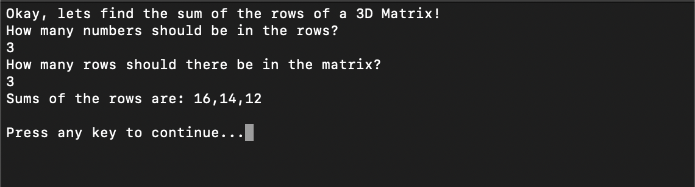

# Prework-CodeChallenges
CF 401d6 prework coding challenges 

## Problem 1: Array Max Result

### Problem Statement
Given an array select a number that exists, and output the computated "score". The method you create should take in both an array of integers and the integer the user selected.

Create a Console application that requests 5 numbers between 1-10. Output the array to the console and Ask the user to select a number. After the selection, output the "score" of the number chosen.

### Output Image

## Problem 2: Leap Year

### Problem Statement
Given a year, report if it is a leap year.

### Output Image

## Promblem 3: Perfect Sequence

### Problem Statement
Given a sequence. Return "Yes" if the sequence is considered a perfect sequence. Otherwise, return "No"

A perfect sequence is a sequence such that all of its elements are non-negative integers and the product of all of them is equal to their sum. For example: [2,2], [1,3,2] and [0,0,0,0] are perfect sequences and [4,5,6] and [0,2,-2] are not perfect sequences. Negative numbers of any kind are not valid in a perfect sequence

### Image Output

#### Success

#### Failure

## Problem 4: Sum of Rows

### Promblem Statement
Given a matrix of integers. Return the sum of each row in a single dimensional array.

Input Format
a multidimensional array with the dimensions of m x n (m = rows, n = columns).

- duplicate integers are possible.
- Negative numbers are possible
- both m and n can vary in length
- The user should specify the length and the width of the array within the console. To populate the numbers, you may randomly generate them, or have the user input one by one.

### Image Output
